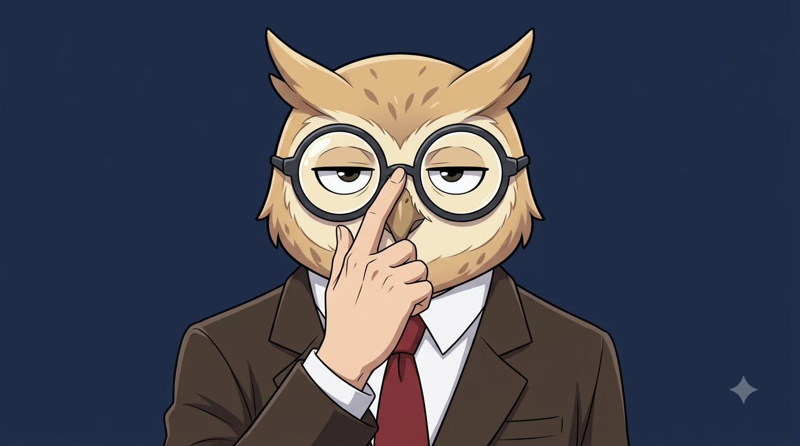
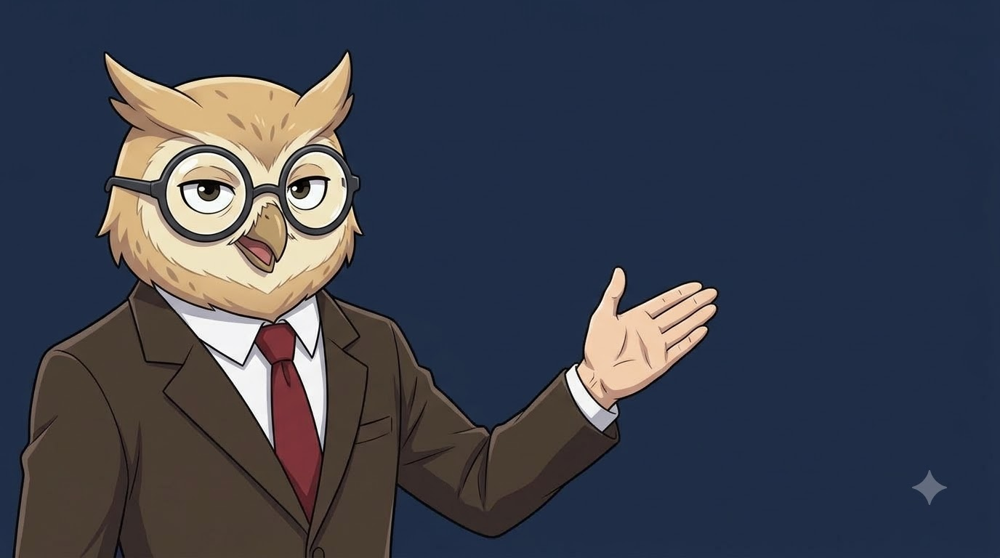
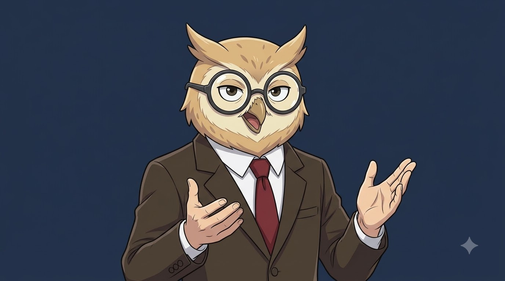
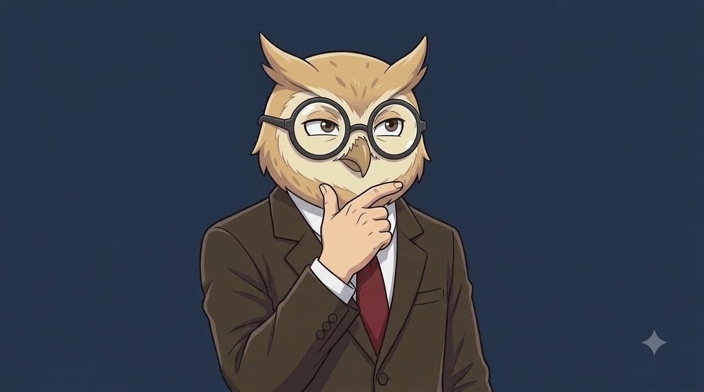
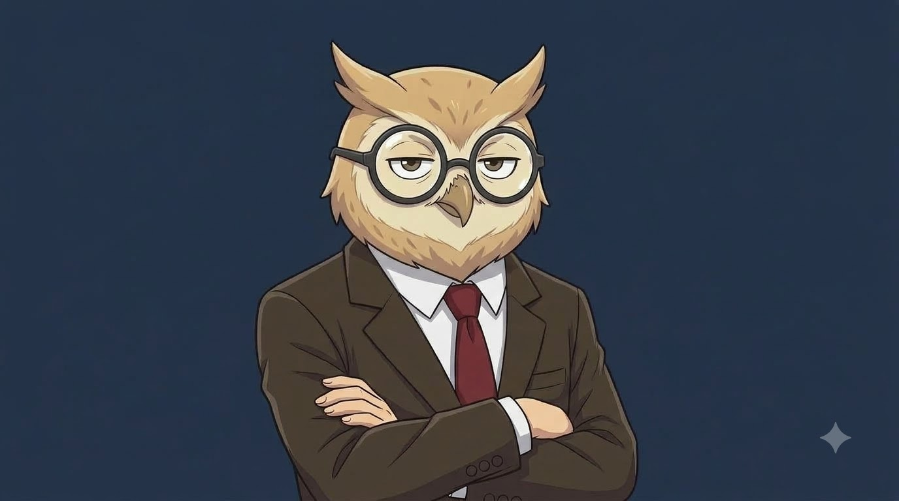

# ThinkLate — Human-Body Owl Host Avatar System
> **Canonical Design Specification for the ThinkLate Host (`@wethinklate`)**  
> **Core Anatomy:** **Human Body (hands, fingers, shoulders, torso in business suit) with Anthropomorphic Owl Head.**  
> **Master Storage:** [`brand/postures/`](file:///c:/Users/sar1s/Documents/MyWork/Git/digital-lab/03-content-lab/thinklate/brand/postures/)

---

## 🖥️ How to Animate in the New Google Flow UI

Based on your Google Flow interface:

```
┌─────────────────────────────────────────────────────────────┐
│ LEFT SIDEBAR       CENTER STAGE             RIGHT SESSION   │
│ • All media        "Start creating          • Untitled      │
│ • Images            or drop media"            session       │
│ • Characters ◄───(Store avatar here!)       • Chat / Prompt │
│ • Scenes                                      input bar:    │
│ • Uploads                                    [ + ] [Prompt] │
└─────────────────────────────────────────────────────────────┘
```

### The 3-Click Animation Flow:
1. **Upload the Starting Posture Image:**
   * In the right-hand session pane, click the **`+` (Plus icon)** inside the prompt input box at the bottom (or drag the PNG directly into the center area labeled *"Start creating or drop media"*).
   * Select your posture image (e.g. `P2_presenting_right.png`).
2. **Paste the Tailored Video Motion Prompt:**
   * In the text box (*"What do you want to create?"*), paste the matching **Video Motion Prompt** for that specific posture from Section 2 below.
3. **Hit the Arrow (`➔`):**
   * Google Flow (Veo) will animate the image directly into an uncompressed high-framerate video loop.
4. **Pro Tip — The "Characters" Tab:**
   * In the left sidebar, click **Characters** to add and save your Owl host once. Google Flow will maintain character consistency across all future projects.

---

## 🌐 Interactive Browser Dashboard
> 💡 **Visual Viewer:** If your IDE Markdown preview restricts local image rendering, open the standalone dashboard directly in your browser:  
> 🔗 **[Open Avatar System Browser Dashboard](file:///c:/Users/sar1s/Documents/MyWork/Git/digital-lab/03-content-lab/thinklate/brand/avatar_system_browser.html)**

---

## 🎨 2. The 5 Master Postures & Their Video Prompts

---

### POSTURE P1: The Signature Glasses Adjustment



* **Master Image File:** [`brand/postures/P1_adjusting_glasses.png`](file:///c:/Users/sar1s/Documents/MyWork/Git/digital-lab/03-content-lab/thinklate/brand/postures/P1_adjusting_glasses.png)
* **Where to use:** Scene 4 (*"So... let's look at the railways"*), Scene 8 (*"The tracks survived"*).
* **Starting Image to Attach:** Attach `P1_adjusting_glasses.png`
* **Google Flow Video Motion Prompt:**
  ```text
  Subtle 2D anime character motion of the character in the reference image. The owl gently adjusts the bridge of his dark round glasses with his right human index finger, then slightly tilts his head while delivering a deadpan, confident direct look at the camera. Occasional eye blink, natural breathing in shoulders and chest, solid deep navy #1B2A4A background, crisp 60fps cel animation, 4k.
  ```

---

### POSTURE P2: The Side-Screen Presenter (The Evidence Workhorse)



* **Master Image File:** [`brand/postures/P2_presenting_right.png`](file:///c:/Users/sar1s/Documents/MyWork/Git/digital-lab/03-content-lab/thinklate/brand/postures/P2_presenting_right.png)
* **Where to use:** Scenes 4, 6, 7, 10, 11, 12 (All evidence citations & PDF documents).
* **Starting Image to Attach:** Attach `P2_presenting_right.png`
* **Google Flow Video Motion Prompt:**
  ```text
  Subtle 2D anime character motion of the owl presenter in the reference image. The owl is on the left side of the frame, body angled right. The owl speaks with natural head nods, occasional eye blinks behind the round glasses, and subtle organic floating motion in the extended presenting right human hand. Natural shoulder breathing motion, solid deep navy #1B2A4A background, crisp 60fps cel animation, 4k.
  ```

---

### POSTURE P3: The Conversational Explainer (Open Hands)



* **Master Image File:** [`brand/postures/P3_explaining_hands.png`](file:///c:/Users/sar1s/Documents/MyWork/Git/digital-lab/03-content-lab/thinklate/brand/postures/P3_explaining_hands.png)
* **Where to use:** Scene 1 (Cold Open Hook), Scene 2 (Core Thesis Promise).
* **Starting Image to Attach:** Attach `P3_explaining_hands.png`
* **Google Flow Video Motion Prompt:**
  ```text
  Subtle 2D anime character motion of the character in the reference image. The owl speaks directly to the camera with natural head movement and eye blinks behind the round glasses. Both open human hands gesture expressively and rhythmically at chest level as if explaining a concept. Natural breathing in shoulders, solid deep navy #1B2A4A background, crisp 60fps cel animation, 4k.
  ```

---

### POSTURE P4: The Contemplative Analyst (Chin Tap)



* **Master Image File:** [`brand/postures/P4_thinking_chin.png`](file:///c:/Users/sar1s/Documents/MyWork/Git/digital-lab/03-content-lab/thinklate/brand/postures/P4_thinking_chin.png)
* **Where to use:** Scene 10 (The 1830s Paradox), Scene 13 (The Final Question Close).
* **Starting Image to Attach:** Attach `P4_thinking_chin.png`
* **Google Flow Video Motion Prompt:**
  ```text
  Subtle 2D anime character motion of the character in the reference image. The owl holds his human hand under his chin in a pensive thinking pose, with head tilted slightly. His eyes shift thoughtfully, with natural eye blinks behind the glasses and slow meditative shoulder breathing. Beak closed, solid deep navy #1B2A4A background, crisp 60fps cel animation, 4k.
  ```

---

### POSTURE P5: The Crossed Arms Invariant



* **Master Image File:** [`brand/postures/P5_arms_crossed.png`](file:///c:/Users/sar1s/Documents/MyWork/Git/digital-lab/03-content-lab/thinklate/brand/postures/P5_arms_crossed.png)
* **Where to use:** Scene 8/9 (*"The tracks survived. The shareholders didn't"*).
* **Starting Image to Attach:** Attach `P5_arms_crossed.png`
* **Google Flow Video Motion Prompt:**
  ```text
  Subtle 2D anime character motion of the character in the reference image. The owl stands with human arms crossed over his chest, looking straight at the camera with an unimpressed deadpan stare. Subtle rhythmic chest breathing, a single slow knowing head nod, and a natural eye blink behind the glasses. Beak closed, solid deep navy #1B2A4A background, crisp 60fps cel animation, 4k.
  ```

---

## 🎬 3. Video Output & DaVinci Resolve Integration

* **Download format:** Save the generated videos from Google Flow as 1080p MP4.
* **Saving Location:** Save them into [`brand/postures/`](file:///c:/Users/sar1s/Documents/MyWork/Git/digital-lab/03-content-lab/thinklate/brand/postures/) as:
  * `video_P1_adjusting_glasses.mp4`
  * `video_P2_presenting_right.mp4`
  * `video_P3_explaining_hands.mp4`
  * `video_P4_thinking_chin.mp4`
  * `video_P5_arms_crossed.mp4`
* **In DaVinci Resolve:**
  1. Drag the video loop onto **Track V2** (or Track V3 above B-roll).
  2. Open the **Color Page** or **Edit Inspector** ➔ Add **3D Keyer** (or Delta Keyer).
  3. Click and drag over the solid `#1B2A4A` navy background to make it 100% transparent.
  4. The animated host now speaks and gestures seamlessly over any B-roll, chart, or evidence document!
